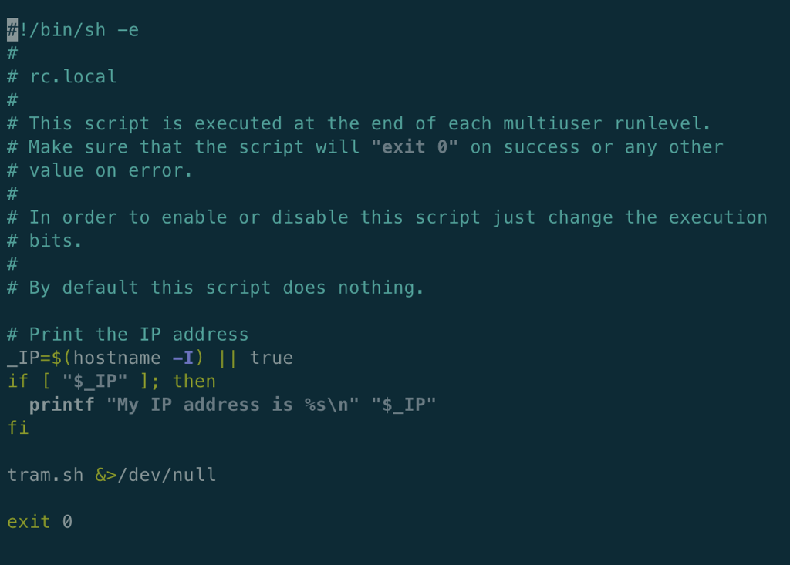

# TFGM Metrolink Clock ⏱🚃 

This repository contains sample code and a build guide for creating your own Metrolink tram time clock. 


You're likely here because you stumbled across [this on Twitter](https://twitter.com/eddible/status/1564917603180617731?s=20&t=dcHyyQINVi-xO-h7mmJiKw). If so, hi! 👋🏻

> As a disclaimer, all the information here is purely offered as guidance and I can't take any responsibility for any damage or problems. That said, feel free to raise an Issue here on GitHub if you have a problem, I'd be more than happy to take a look. Similarly, I'm more than happy to receive pull requests!  
> 
> This is all provided free of charge, but if you find it useful and want to show your appreciation, you can buy me a coffee at the link below - thanks!
> 
> [](https://www.buymeacoffee.com/eddabrahamsen)


## Required hardware
> ⚠️ At the time of writing the screen and Pi are both out of stock. I suspect the screen will be back soon, but the Raspberry Pi remains difficult to buy due to the ongoing chip shortages. [Pi Locator](https://rpilocator.com/) is a great resource for tracking down stock. 
* [Hyperpixel 2.1 Round](https://shop.pimoroni.com/products/hyperpixel-round?variant=39381081882707)
* [Mounting Screws](https://shop.pimoroni.com/products/short-pi-standoffs-for-hyperpixel-round?variant=39384564236371) - You actually only need 4x M2.5 5mm screws but this was just convenient at the time. 
* [Raspberry Pi Zero 2 WH](https://shop.pimoroni.com/products/raspberry-pi-zero-w?variant=39458414297171)  
> ⚠️ You'll need headers on your Pi, the one linked above comes pre-soldered. If you have or buy a Pi without headers, you'll need to solder them on yourself.
* [Micro SD Card for the Pi Zero](https://www.amazon.co.uk/dp/B08GY9NYRM/ref=twister_B0925JD7Z4?_encoding=UTF8&th=1) - Don't use an unbranded/cheap SD Card - stick to decent brands like Samsung to save yourself dealing with random errors.
* [3D Printed Case](https://cults3d.com/en/3d-model/gadget/sphere-enclosure-w-bump-legs-m3o101-for-pimoroni-hyperpixel-2-1-round-touch-and-raspberry-pi) - Massive credit to printminion for the excellent design! The link is to the exact one I printed, but there are variations available.  
* Micro USB cable
* Optional USB plug like a phone charger, but it should power fine from a standard USB port or battery. 

## Build Guide

### Print the case

* 

Printminion provides guidance on the [Cults3D page](https://cults3d.com/en/3d-model/gadget/sphere-enclosure-w-bump-legs-m3o101-for-pimoroni-hyperpixel-2-1-round-touch-and-raspberry-pi) which I followed. I'm using a Creality CR-6 SE and I used eSuns excellent PLA+ which is [readily available on Amazon here in the UK.](https://www.amazon.co.uk/eSUN-Filament-Dimensional-Accuracy-Printing/dp/B081Q7VJGT)

I use Prusa Slicer for my printer, which has a built-in profile for the CR-6 and the eSun PLA (it's down as PLA+ which means it doesn't show up for the CR-6 - just duplicate it and change the material type to PLA and it works just fine). From there I think all I changed was the layer height to 0.3.  

Of course the above is only really relevant to the CR-6 so use your own judgement for your printer. 

It took about 18 hours, and unfortunately you will need support material. Handily it all sits inside so although it's very awkward to remove it (I basically ended up ripping it out using a screwdriver), none of the surfaces the support touches are visible. It's also a good idea to keep the print on the slower side (I stuck with 50mm/s) to ensure you get good adhesion - you don't want it coming apart when removing the supports. I know that Cura offers a 'tree' type support which may well work well for this, let me know if you have any tips from your own prints!

### Flash your Micro SD Card 
> ⚠️ The software for the screen is currently incompatible with the latest versions of Raspbian. As such, you'll want to flash your SD card with the "legacy" version. 
* Download the [Raspberry Pi Imager](https://www.raspberrypi.com/software/) and install it on your computer 
* Launch it with your Micro SD Card plugged into your computer.
* Click `Choose OS` → `Raspberry Pi OS (Other)` → `Raspberry Pi OS Lite (Legacy)`
* Click `Choose Storage` and select your Micro SD card - make sure you're definitely selecting your card! If you're unsure, unplug the card and see what disappears. 
* Click the cog icon down the bottom right
    * Tick on `Enable SSH` → `Use password authentication`
    * Tick on `set username and password` → Leave the username as `pi` (if you must change it, you'll need to update `tram.sh`) but set a password. You'll be typing it in a few times so make it secure but memorable. 
    * Tick on `Configure wifi` → Enter your Wi-Fi details as instructed 
    * Click `Save` when you're done
    
* Click `Write` and wait for the OS to be written to your SD Card
* Insert it into your Pi Zero, connect it to power and give it a few minutes to complete the first boot.  

### Get a TFGM API Token and obtain your line ID
* Go [here](https://developer.tfgm.com/) and register for an account with TFGM
* Once registered and logged in, go [here](https://developer.tfgm.com/developer) and click `Show` next to `Primary Key` - make a note of this key, you'll need it shortly. 
* If you already know your line ID, you can skip to installing the software, otherwise go [here](https://developer.tfgm.com/docs/services) and click `Open Data Service Version 2.0 API`
* Select `Metrolinks` in the left hand navigation
* Click `Try it`  
* In the field labelled `$filter` enter: `StationLocation eq 'Timperley'` replacing `Timperley` with your desired Station. 
* Scroll down and click `Send`
* The API will return a JSON document with all the signs at that Station. It'll look like this, you want to get the ID for the one you want one your screen:
* 
* Pay attention to the `Direction` key, as well as `Dest0` to help figure out the one you need. 
* Once you have it, make a note of it alongside your API token. 

### Installing the software 
> The easiest way to manage a device like this is over SSH. If you're struggling with SSH, you should be able to follow along by connecting your Pi to a screen and plugging in a keyboard. The Pi Zero uses mini ports so you'll need some adaptors. 

* Open your Terminal (On Windows, you should be able to use Powershell without issue, on macOS you can use Terminal)
* Depending on your network, you should be able to connect to your Pi using this command: `ssh pi@raspberrypi.local` 
    * If the above does not work, you'll need to log into your router and find out the IP address the router has assigned to it. From there, you can access it using something like `ssh pi@192.168.1.77`, replacing the IP address for the one on your network.
    * If you're still struggling to obtain your IP address, get everything connected to a screen and keyboard and type in `ifconfig` which will also display your IP
    * And if that doesn't work, you may have had a problem when flashing your card, or the card maybe bad. Try reflashing the card, and double check your Wi-Fi details that you entered in the settings.
    
* Once connected, we can download the code and move into the director:  
    * `git clone https://github.com/eddible/tfgm-tram-clock`
    * `cd tfgm-tram-clock`
* Install required libraries (this is done using sudo because the screen won't work unless you run the script as root)
    * If you're on a fresh install, you probably won't have pip installed so run this first: `sudo apt install python3-pip`
    * Then this: `sudo pip3 install -r requirements.txt`
* You can now configure your config file with your own details. Run these commands:
    * `mv config.ini.sample config.ini`
    * `nano config.ini`
    * Edit the file with your API token from TFGM and the number for the board you wish to read from -  use your arrow keys to navigate around. You don't need quote marks or anything like that, it should be formatted like this:
      ```
      [TFGM-CONFIG]
      api_key = c123456789
      tram_line = 749
      ``` 
    * Once done, press `CTRL+X` → `Y` → `Enter`
* Next we'll set the script to launch at start up. Run these commands:
  * `sudo cp tram.sh /usr/bin`
  * `sudo chmod +x /usr/bin/tram.sh`
  * `sudo nano /etc/rc.local`
    * A text editor will open in your terminal window. Use your arrow keys to move to the bottom of the file and create a space above `exit 0` and enter this: `tram.sh &>/dev/null` - it should look a bit like this:

* 

* To save your changes, press `CTRL+X` → `Y` → `Enter`
* That's it for the software, let's shutdown the Pi and plug everything in: `sudo shutdown now`

### Connect the LCD to the Pi

> ⚠️ The screen is very fragile, so I don't want to take mine apart to demonstrate - hopefully this makes sense in text. 
  
* You want to place the screen on the outside, lining it up with the slot on the case, then carefully screw in the 4 screws provided in the stand-off kit. The angle here is really awful so just take your time. I found it worked best with a very thin screwdriver. 
* 
* Plug your Pi's USB cable into it's Power port (it's the outermost port - if you don't plug it in now, it's very awkward to do later)
* You'll now want to line up the headers of your Pi with the socket on the screen and very carefully push them together. Before you do it, read Pimoroni's guidance on connecting the screen: 

> When installing HyperPixel 2.1 Round onto your Pi make sure not to press down on the screen surface. We recommend putting the screen face down on a soft surface and gently wiggling the Pi to mate with the extended header (or GPIO header). If you need to remove your Hyperpixel, take care not to pull on the edges of the glass display - it's best to hold on to the rectangular PCB. As the glass edges of this display overhang the PCB they're quite exposed, so it's worth being extra careful with them.

* Use your fingers to feel around the join of the header and the screen and ensure it's fully seated. On my first attempt I realised I'd only pushed it in about half way. Take it slowly, keep the Pi as level as you can and if you feel a lot of resistance, stop and check. 

### Power it on
* That's it! You can now plug the clock back into power and see what happens! All being well, it'll load straight up with the relevant tram times that you specified earlier! 

### Troubleshooting
* At the moment, there's no error handling for restarting the script if it crashes (most likely due to losing its network connection). I will look to add this, either using systemd to manage it as a service or just something within the script. Nonetheless, for now if it does crash you'll just want to turn it off and back on again. 